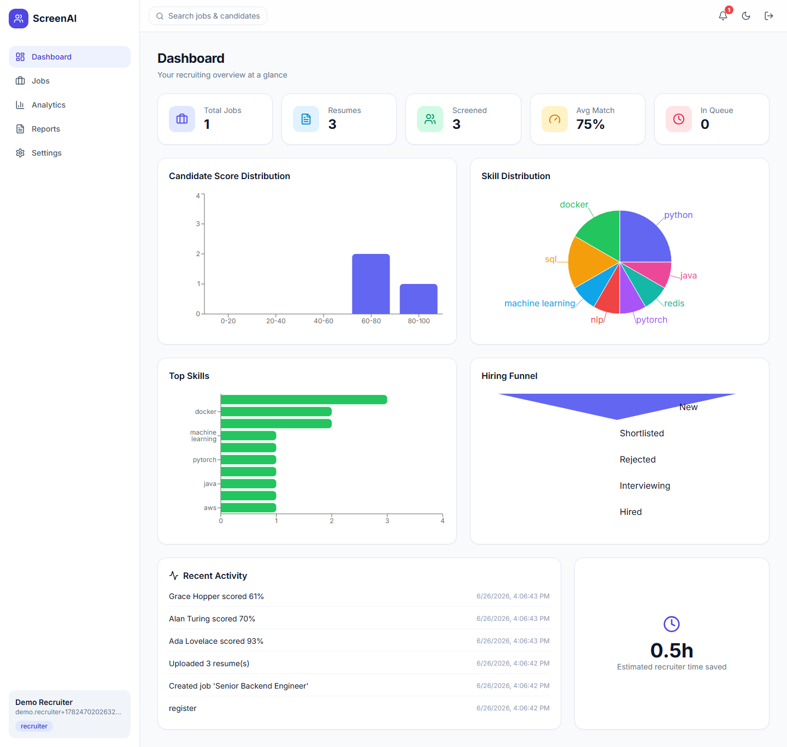
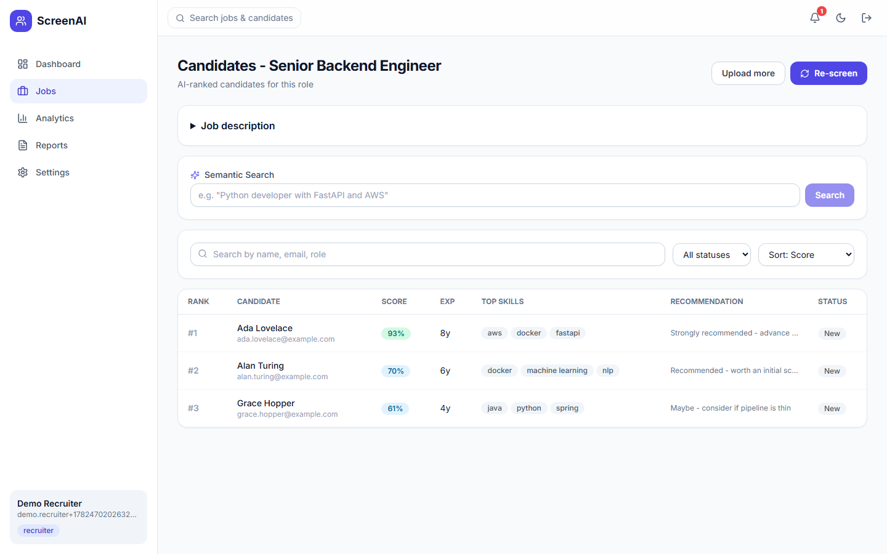
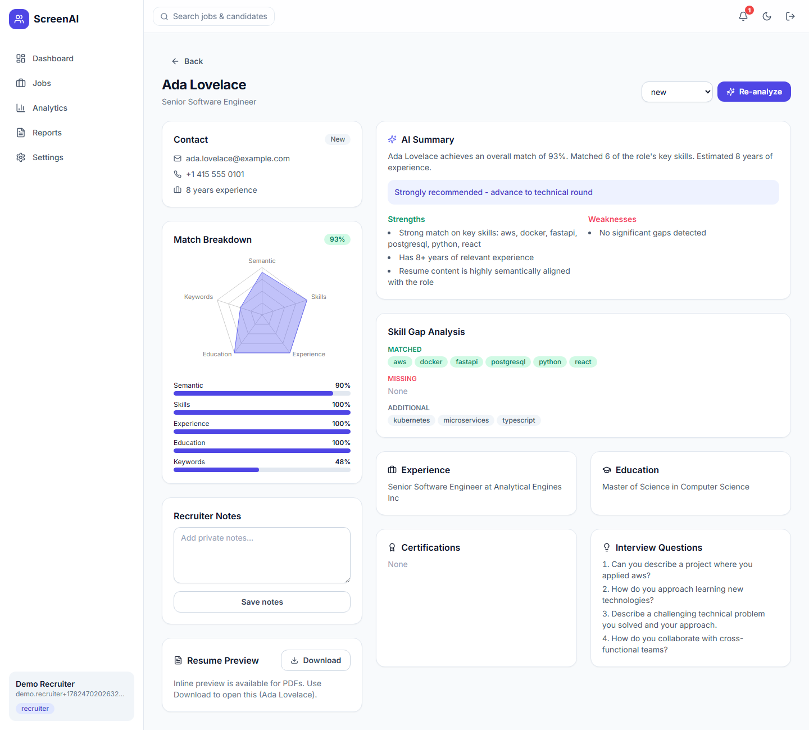
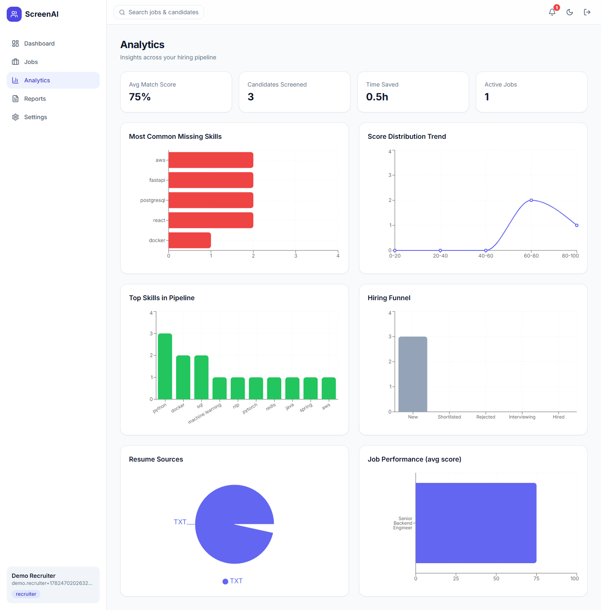
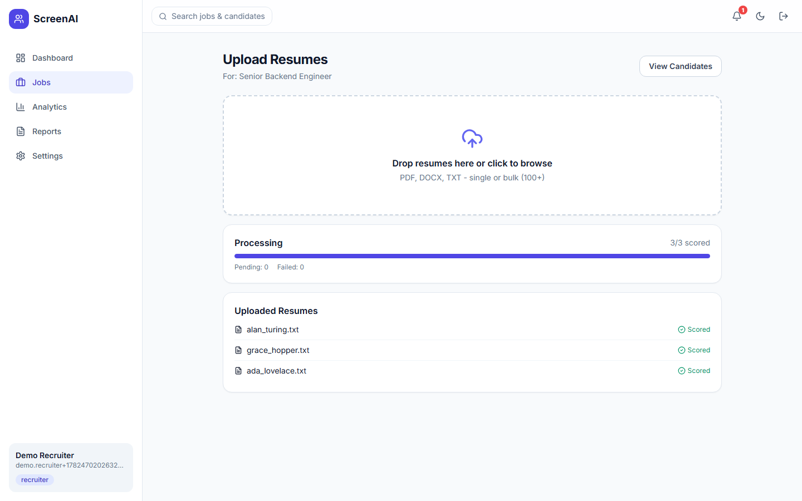
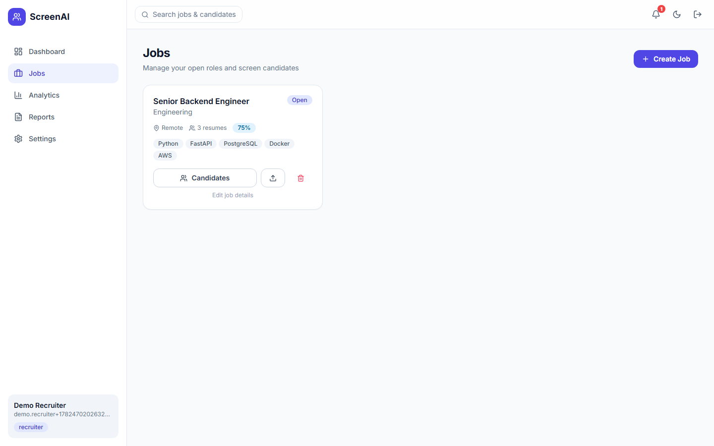
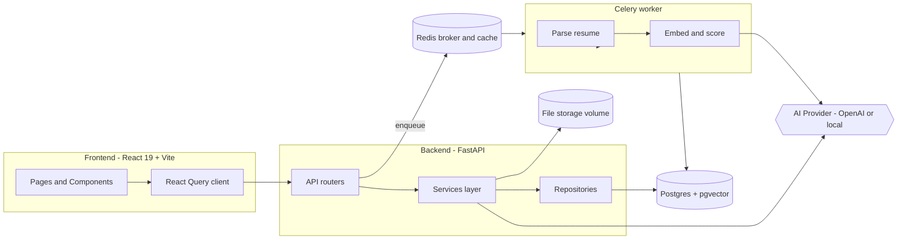

# ScreenAI - AI-Powered Resume Screener

A production-ready, full-stack Applicant Tracking System (ATS) that automatically
ranks resumes against a job description using **semantic search (pgvector)**,
**LLM analysis**, and classic **NLP** techniques. Recruiters get AI-ranked
candidates, skill-gap analysis, and explainable scores in seconds instead of
manually reviewing hundreds of resumes.

> Runs fully with **zero external cost** out of the box: when no `OPENAI_API_KEY`
> is configured, the system falls back to a local `sentence-transformers` model
> for embeddings and a heuristic analyzer. Add a key to upgrade to OpenAI.

---

## Table of Contents
- [Screenshots](#screenshots)
- [Architecture](#architecture)
- [Tech Stack](#tech-stack)
- [Folder Structure](#folder-structure)
- [Quick Start (Docker)](#quick-start-docker)
- [Local Development](#local-development-without-docker)
- [Configuration](#configuration)
- [How Scoring Works](#how-scoring-works)
- [API Documentation](#api-documentation)
- [Testing](#testing)
- [Deployment](#deployment)
- [Performance](#performance)
- [Future Improvements](#future-improvements)

---

## Screenshots

> Captured from the running app with seeded demo data. To regenerate, start the
> stack (`docker compose up`) and run `node docs/capture_screenshots.mjs`
> (after `npx playwright install chromium`).

### Recruiter Dashboard
At-a-glance KPIs, score distribution, skill mix, and a hiring funnel.



### Candidate Ranking
AI-ranked candidates per job with semantic search, filters, and an expandable rich-text job description.



### Candidate Detail
Match breakdown radar, AI summary, skill-gap analysis, interview questions, and inline resume preview.



### Analytics
Missing-skill trends, score distribution, top skills, hiring funnel, resume sources, and per-job performance.



### Bulk Upload
Drag-and-drop resume upload with live processing status.



### Jobs
Job listings with per-role screening stats.



---

## Architecture



**Flow:** A recruiter creates a job (its description is embedded into a vector).
Resumes are uploaded and queued to Celery, which extracts text (PyMuPDF /
pdfplumber / python-docx), normalizes structured fields, embeds the resume, then
computes a weighted match score and an AI analysis. Candidates are ranked and
searchable via pgvector cosine similarity.

---

## Tech Stack

| Layer | Technologies |
| --- | --- |
| Backend | Python 3.12, FastAPI, SQLAlchemy 2, Pydantic v2, Alembic |
| Database | PostgreSQL 16 + pgvector |
| Async | Celery + Redis |
| AI / NLP | OpenAI API (optional), sentence-transformers, regex/heuristic NLP |
| Auth | JWT (access + refresh rotation), bcrypt |
| Frontend | React 19, TypeScript, Vite, Tailwind CSS, React Query, React Router, Recharts, Framer Motion |
| DevOps | Docker, Docker Compose, Nginx, GitHub Actions |

---

## Folder Structure

```
ATS/
├── backend/
│   ├── app/
│   │   ├── api/routes/      # auth, jobs, resumes, candidates, ai, analytics, reports, admin, notifications
│   │   ├── core/            # config, database, security, logging, deps
│   │   ├── models/          # SQLAlchemy ORM models
│   │   ├── schemas/         # Pydantic request/response models
│   │   ├── repositories/    # DB access layer
│   │   ├── services/        # business logic (parsing, matching, screening, ai/, reports)
│   │   ├── workers/         # Celery app + tasks
│   │   ├── utils/           # file handling
│   │   └── main.py          # FastAPI entrypoint
│   ├── alembic/             # migrations
│   ├── tests/               # pytest suite
│   ├── Dockerfile
│   └── requirements.txt
├── frontend/
│   ├── src/
│   │   ├── components/      # Layout, UI primitives, NotificationBell, SkillsInput
│   │   ├── pages/           # Login, Register, Dashboard, Jobs, Candidates, ...
│   │   ├── context/         # Auth + Theme providers
│   │   ├── services/        # typed API clients
│   │   ├── lib/             # axios instance w/ token refresh
│   │   └── types/           # shared TS types
│   ├── Dockerfile           # prod (nginx)
│   ├── Dockerfile.dev       # dev (vite)
│   └── nginx.conf
├── docker-compose.yml        # dev stack
├── docker-compose.prod.yml   # prod stack
├── .github/workflows/ci.yml
└── .env.example
```

---

## Quick Start (Docker)

Prerequisites: **Docker Desktop**.

```bash
# 1. Copy environment file
cp .env.example .env          # (Windows PowerShell: copy .env.example .env)

# 2. (Optional) add your OpenAI key in .env -> OPENAI_API_KEY=sk-...
#    Leave blank to use the free local model.

# 3. Build and start everything
docker compose up --build
```

Services:
- Frontend: http://localhost:5173
- API + Swagger docs: http://localhost:8000/docs
- Health check: http://localhost:8000/health

The backend automatically runs Alembic migrations (which enable the pgvector
extension and create the ivfflat index) on startup.

**First registered user becomes an admin** so the admin panel is reachable.

---

## Local Development (without Docker)

You still need Postgres (with pgvector) and Redis available. Docker is strongly
recommended for those two. Then:

```bash
# Backend
cd backend
python -m venv .venv && .venv\Scripts\activate   # PowerShell
pip install -r requirements.txt
python -m spacy download en_core_web_sm           # optional
alembic upgrade head
uvicorn app.main:app --reload

# Celery worker (separate terminal)
celery -A app.workers.celery_app.celery_app worker --loglevel=info --pool=solo  # solo pool for Windows

# Frontend (separate terminal)
cd frontend
npm install
npm run dev
```

---

## Configuration

Key environment variables (see `.env.example` for all):

| Variable | Default | Description |
| --- | --- | --- |
| `AI_PROVIDER` | `auto` | `auto` uses OpenAI if a key is set, else local |
| `OPENAI_API_KEY` | _(empty)_ | Enables OpenAI embeddings + analysis |
| `EMBEDDING_DIM` | `384` | Vector dimension (auto-resolved per provider) |
| `SECRET_KEY` | _change me_ | JWT signing secret |
| `RATE_LIMIT_PER_MINUTE` | `120` | Per-IP request limit |
| `MAX_UPLOAD_SIZE_MB` | `20` | Per-file upload cap |

> Note: the pgvector column dimension is fixed at migration time based on the
> active provider. If you switch between OpenAI (1536-dim) and local (384-dim),
> recreate the volume / re-run migrations.

---

## How Scoring Works

The **overall match score** is a weighted blend of five signals, each normalized
to 0-100:

| Signal | Weight | Method |
| --- | --- | --- |
| Semantic similarity | 40% | Cosine similarity of JD vs resume embeddings (pgvector) |
| Skill match | 25% | Overlap of canonical skills (curated taxonomy) |
| Experience match | 20% | Candidate years vs required years |
| Education match | 10% | Highest degree level vs requirement |
| Keyword match | 5% | JD keyword coverage in resume text |

The full breakdown is stored per candidate (`score_breakdown`) and surfaced in
the UI as an explainable radar chart. The AI layer then generates a summary,
strengths, weaknesses, missing skills, a hiring recommendation, culture-fit
assessment, and tailored interview questions.

---

## API Documentation

Interactive OpenAPI docs are served at **`/docs`**. Highlights:

| Method | Endpoint | Description |
| --- | --- | --- |
| POST | `/api/auth/register` | Register (first user = admin) |
| POST | `/api/auth/login` | Login, returns access + refresh tokens |
| POST | `/api/auth/refresh` | Rotate refresh token |
| POST | `/api/auth/forgot-password` | Issue reset token |
| GET/POST/PUT/DELETE | `/api/jobs` | Manage jobs |
| POST | `/api/jobs/{id}/upload` | Upload single/bulk resumes |
| GET | `/api/jobs/{id}/progress` | Bulk processing progress |
| GET | `/api/jobs/{id}/candidates` | Ranked candidates (search/filter/sort/paginate) |
| GET | `/api/candidates/{id}` | Candidate profile + score |
| GET | `/api/candidates/{id}/skill-gap` | Skill gap analysis |
| POST | `/api/screen` | Re-screen all resumes for a job (async) |
| POST | `/api/match` | Synchronously score one resume |
| POST | `/api/analyze` | Re-run AI analysis for a candidate |
| POST | `/api/search` | Semantic candidate search (pgvector) |
| GET | `/api/analytics/dashboard` | Dashboard metrics + charts |
| GET | `/api/reports/{id}/pdf` \| `/csv` | Download reports |
| GET | `/api/admin/*` | Admin: users, logs, stats |

---

## Testing

```bash
# Backend (unit tests run without a DB; integration needs Postgres)
cd backend && pytest -q

# Frontend
cd frontend && npm run test
```

CI (`.github/workflows/ci.yml`) spins up Postgres+pgvector and Redis, runs
migrations, and executes both test suites on every push/PR.

---

## Deployment

A production compose file is included:

```bash
docker compose -f docker-compose.prod.yml up --build -d
```

This runs the backend under Gunicorn/Uvicorn workers, a Celery worker, and the
frontend as static files served by Nginx (which also reverse-proxies `/api`).
The same images deploy cleanly to **Render**, **Railway**, or **Azure Container
Apps** - set the environment variables from `.env.example` in the platform's
dashboard and point a managed Postgres (with pgvector) and Redis at the app.

---

## Performance

- **pgvector ivfflat** cosine index for sub-2s semantic search at 10k+ vectors.
- Indexed foreign keys and score columns for fast ranking queries.
- Async bulk processing via Celery keeps the API responsive for 100s-1000s of resumes.
- Server-side pagination, filtering, and sorting.
- Frontend lazy data fetching with React Query caching + loading skeletons.

---

## Future Improvements

- OCR for scanned PDFs (Tesseract) and multi-language parsing.
- Duplicate / plagiarism detection via embedding clustering.
- Candidate comparison view and AI recruiter chatbot.
- Email shortlisted candidates + calendar interview scheduling.
- Multi-tenant organizations and full audit logging.
- AI salary estimation and skill-trend analytics.
- Code-splitting the frontend bundle and adding e2e tests.
